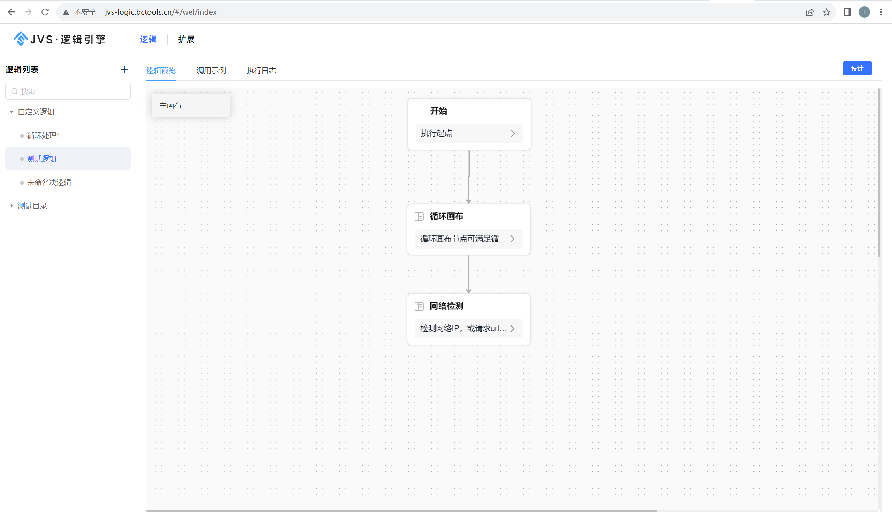
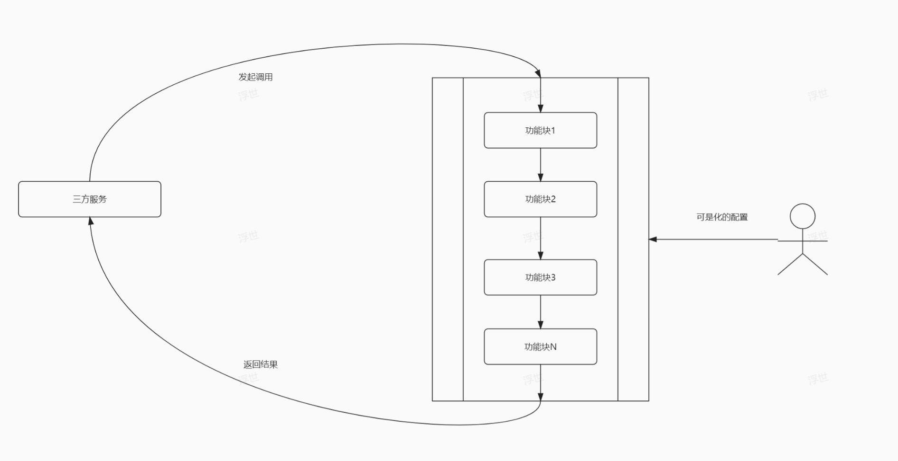

# jvs-logic逻辑引擎

#### 基础介绍
我们再做日常开发过程中，把通用的业务逻辑通过高级语言写出来后，需要把代码编译为可执行的程序，并发布出来，然后普通用户才能使用。当业务需求不常变化的情况下 还好，但是一旦业务需求经常变化，那么整个过程就变得相当麻烦的执行：

- 开发人员更具变化的需要调整的内容进行重新编写业务代码
- 编写业务代码后代码编译
- 需要运维人员发布部署
- 测试人员对发布的功能进行验证，发现问题
- 然后重新进入第一步，如此循环
- 

如果执行过程涉及的人员多、涉及的环境多，那么整个过程调整起来是相当消耗工作量的。
所以大家就在想，能否有一种所见即所得，所配即所需的方式就可以缩短刚才的这个过程。 那么逻辑引擎就是干这个事情。

#### JVS-logic（逻辑引擎）的作用

逻辑引擎是通过对原子服务能力的可视化编排，同时接入外部应用，以满足数据处理、业务实现、自动化业务的实现。轻松实现业务功能，无需复杂冗长的开发过程，如下示意图：

逻辑引擎作为可动态变化的功能拼装集合，可以设计整个逻辑模块的输入、组装执行过程、生成标准的输出结果。

#### JVS逻辑引擎的特点

- 使用简单，支持界面化拖拽配置
- 即时生效，配置即使用，界面化调试
- 多方式运行，外部调用，定时执行、周期执行
- 扩展简单，快速扩展自定义原子能力组件
- 容易集成，可对外提供API，也可快速接入API

#### JVS其他产品说明

地址说明：

- 管理平台（含管理平台、低代码）：https://frame.bctools.cn/
- 数据智仓（数据分析平台）：http://bi.bctools.cn/
- 企业文档：http://knowledge.bctools.cn/
- 企业计划（项目管理）：http://teamwork.bctools.cn/
- 企业邮筒（Web邮箱客户端）：http://mailbox.bctools.cn/
- 规则引擎：http://rules.bctools.cn/
- 逻辑引擎：http://logic.bctools.cn/
- 视频会议：http://meeting.bctools.cn/
- APS（智能排产）：https://aps.bctools.cn/

普通用户端：体验者自有微信扫码登录
管理端(全网共享)：testadmin 123456
管理端+应用编辑：联系运营微信号 ruanjbz，开设独立环境与独立账号
管理端+平台配置+应用编辑：联系运营微信号 ruanjbz，获取私有化部署文档与安装包

- 

### 技术交流与商务支持

如因人数限制无法加群时，可加运营同学拉入技术交流群

